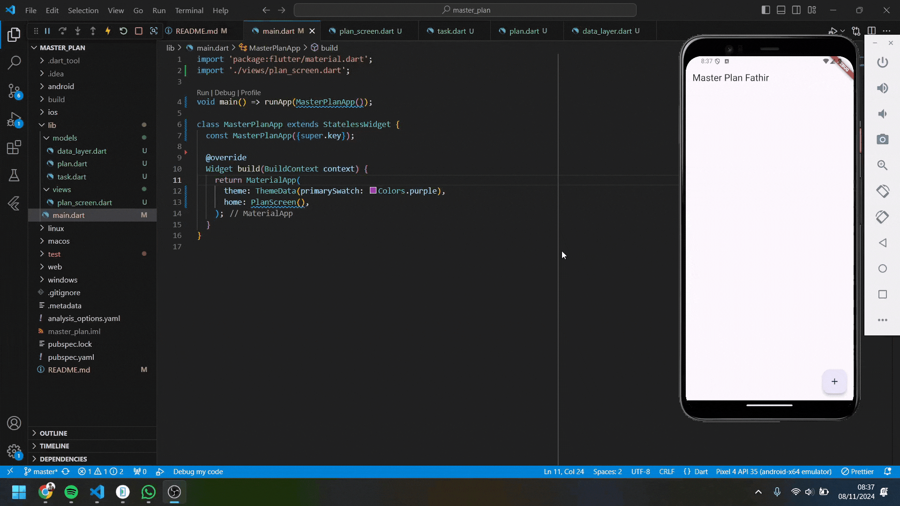

Nama    : Ahmed Fathir Syafaat

Kelas   : TI - 3H

NIM     : 2241720083

# #10 | Dasar State Management

## Praktikum 1: Dasar State dengan Model-View

## Tugas Praktikum 1: Dasar State dengan Model-View
1. Selesaikan langkah-langkah praktikum tersebut, lalu dokumentasikan berupa GIF hasil akhir praktikum beserta penjelasannya di file README.md! Jika Anda menemukan ada yang error atau tidak berjalan dengan baik, silakan diperbaiki.
2. Jelaskan maksud dari langkah 4 pada praktikum tersebut! Mengapa dilakukan demikian?
> Membuat data_layer.dart yang bertujuan untuk mengekspor kedua model plan.dart dan task.dart, agar memudahkan untuk mengelola import. Jadi, pada file lain yang membutuhkan Plan atau Task, cukup mengimport data_layer.dart tanpa harus mengimport kedua file secara terpisah.

3. Mengapa perlu variabel plan di langkah 6 pada praktikum tersebut? Mengapa dibuat konstanta ?
> Variabel plan digunakan untuk menyimpan daftar tugas atau sebuah to-do list yang dapat dikelola oleh aplikasi. Sebagai sebuah instance dari class Plan, plan memungkinkan kita untuk mengakses dan mengubah daftar tugas yang sedang aktif. Variabel ini ditetapkan sebagai konstanta untuk menginisialisasi nilai default pada aplikasi sehingga aplikasi memiliki nilai awal dan lebih mudah untuk dirender ulang tanpa menimbulkan masalah perubahan state. Dengan menggunakan const, kita juga mencegah terjadinya perubahan data secara langsung, membuat data menjadi immutable, dan mendorong perubahan data melalui pembaruan state.

4. Lakukan capture hasil dari Langkah 9 berupa GIF, kemudian jelaskan apa yang telah Anda buat!

> Aplikasi menampilkan daftar tugas atau sebuah to-do list dengan masing-masing item berupa Checkbox dan TextFormField. Checkbox yang berfungsi untuk penanda apakah tugas sudah selesai, sedangkan TextFormField memungkinkan pengguna untuk mengubah deskripsi tugas. 

5. Apa kegunaan method pada Langkah 11 dan 13 dalam lifecyle state ?
> - initState(): Menginisialisasi state saat widget pertama kali dibuat. initState digunakan untuk membuat ScrollController dan menambahkan listener yang akan menutup keyboard ketika pengguna melakukan scroll.
> - dispose(): Membersihkan resource ketika widget tidak lagi digunakan. dispose akan membuang ScrollController saat widget PlanScreen dihancurkan, sehingga mencegah memory leak.

1. Kumpulkan laporan praktikum Anda berupa link commit atau repository GitHub ke dosen yang telah disepakati !